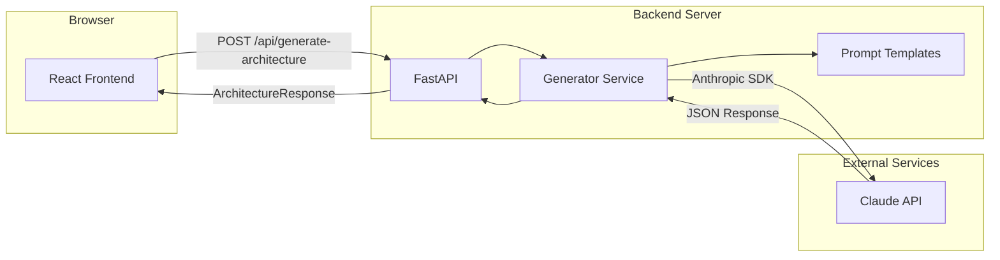
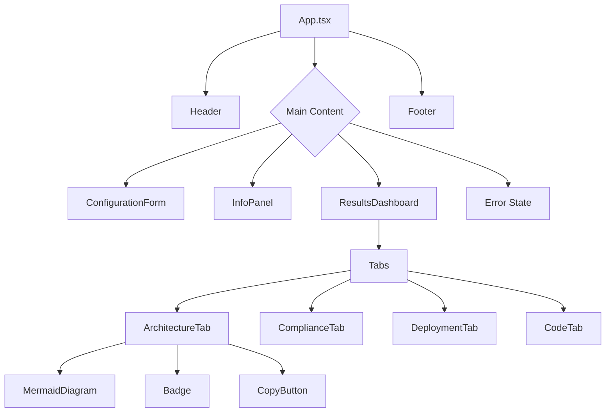
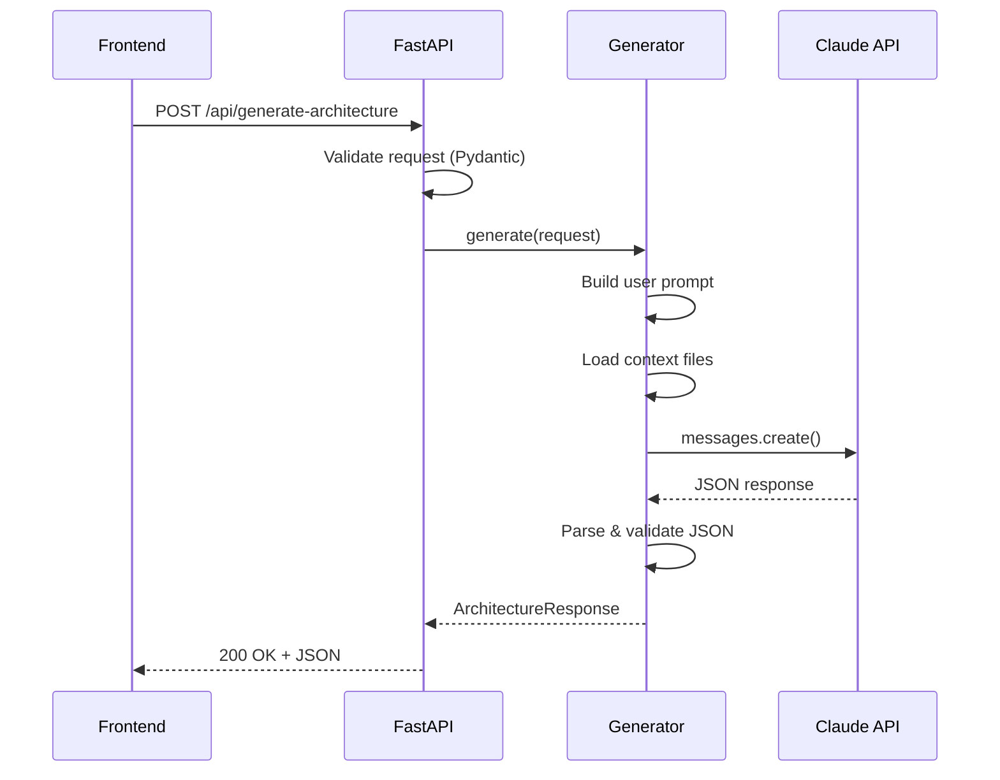
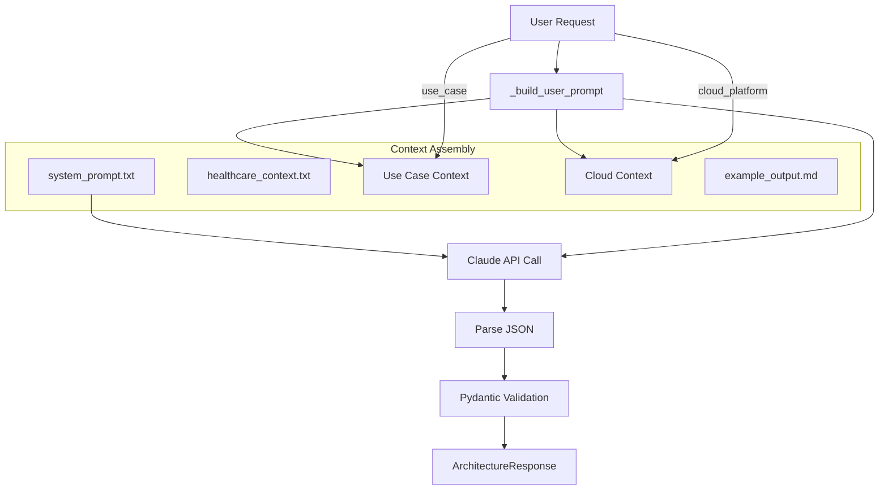

# Architecture Documentation

## GSI Reference Architecture Generator

This document describes the technical architecture of the GSI Reference Architecture Generator.

---

## System Overview



The system follows a simple three-tier architecture:

1. **Frontend (React)**: Single-page application for user interaction
2. **Backend (FastAPI)**: API server that orchestrates Claude requests
3. **Claude API**: Anthropic's AI service that generates architectures

---

## Frontend Architecture

### Technology Stack

- **React 18** with TypeScript
- **Vite** for build tooling
- **TailwindCSS** for styling
- **Mermaid.js** for diagram rendering
- **Lucide React** for icons

### Component Hierarchy



### Component Responsibilities

| Component | Location | Purpose |
|-----------|----------|---------|
| `App` | `src/App.tsx` | Root component, state management, routing between form and results |
| `Header` | `components/layout/Header.tsx` | Logo, title, navigation |
| `Footer` | `components/layout/Footer.tsx` | Attribution, links |
| `ConfigurationForm` | `components/form/ConfigurationForm.tsx` | 5 select inputs for architecture options |
| `InfoPanel` | `components/form/InfoPanel.tsx` | Feature list, Claude branding |
| `ResultsDashboard` | `components/results/ResultsDashboard.tsx` | Tab container, export actions |
| `Tabs` | `components/results/Tabs.tsx` | Reusable tab navigation |
| `ArchitectureTab` | `components/results/ArchitectureTab.tsx` | Diagram, components table, data flows |
| `ComplianceTab` | `components/results/ComplianceTab.tsx` | HIPAA checklist by category |
| `DeploymentTab` | `components/results/DeploymentTab.tsx` | Steps, IAM, network, monitoring |
| `CodeTab` | `components/results/CodeTab.tsx` | Python/TypeScript samples |
| `MermaidDiagram` | `components/ui/MermaidDiagram.tsx` | Renders Mermaid syntax to SVG |
| `Badge` | `components/ui/Badge.tsx` | Status indicators (PHI, priority) |
| `CopyButton` | `components/ui/CopyButton.tsx` | Copy-to-clipboard with feedback |

### State Management

The application uses React's `useState` for state management:

```typescript
// App.tsx
const [state, setState] = useState<GenerationState>({ status: 'idle' });
const [formData, setFormData] = useState<ArchitectureRequest>({...});
```

**GenerationState** has four statuses:
- `idle`: Form is displayed, waiting for user input
- `loading`: Request in progress, showing spinner
- `success`: Results displayed in dashboard
- `error`: Error message displayed

### Key Files

| File | Purpose |
|------|---------|
| `src/lib/types.ts` | TypeScript interfaces for request/response, form option constants |
| `src/lib/api.ts` | API client with `generateArchitecture()` function |
| `src/lib/utils.ts` | Utilities: `cn()`, `copyToClipboard()`, `downloadFile()` |
| `src/styles/globals.css` | Tailwind layers, component classes (.btn, .card) |

---

## Backend Architecture

### Technology Stack

- **Python 3.9+**
- **FastAPI** for API framework
- **Pydantic** for request/response validation
- **Anthropic SDK** for Claude integration
- **Uvicorn** for ASGI server

### Application Structure

```
backend/
├── app/
│   ├── __init__.py
│   ├── main.py              # FastAPI application, endpoints
│   ├── models.py            # Pydantic request/response models
│   └── services/
│       ├── __init__.py
│       └── generator.py     # Claude integration, prompt building
├── prompts/
│   ├── system_prompt.txt    # Healthcare IT architect persona
│   ├── healthcare_context.txt   # HIPAA/PHI context
│   ├── aws_bedrock_context.txt  # AWS services
│   └── gcp_vertex_context.txt   # GCP services
├── templates/
│   └── example_output.md    # Few-shot example for Claude
└── requirements.txt
```

### Request Flow



### Prompt Assembly Pipeline

The `ArchitectureGenerator` class builds prompts from multiple sources:



**Context Sources**:

1. **System Prompt**: Establishes Claude as a Healthcare IT Solutions Architect
2. **Healthcare Context**: HIPAA Security Rule details, PHI categories
3. **Use Case Context**: Inline in `generator.py` - integration points and compliance requirements for each use case
4. **Cloud Context**: Platform-specific services and patterns (AWS or GCP)
5. **Example Output**: JSON structure for few-shot learning

### Key Classes

**ArchitectureGenerator** (`services/generator.py`):
```python
class ArchitectureGenerator:
    def __init__(self, api_key: str)
    def _load_prompt(self, filename: str) -> str
    def _load_template(self, filename: str) -> str
    def _get_use_case_context(self, use_case: UseCase) -> str
    def _get_cloud_context(self, platform: CloudPlatform) -> str
    def _build_user_prompt(self, request: ArchitectureRequest) -> str
    async def generate(self, request: ArchitectureRequest) -> ArchitectureResponse
```

---

## Data Flow

### Request Schema

```typescript
interface ArchitectureRequest {
  useCase: 'clinical-documentation' | 'prior-authorization' | 'medical-coding' | 'patient-communication';
  cloudPlatform: 'aws-bedrock' | 'gcp-vertex';
  integrationPattern: 'api-gateway' | 'event-driven' | 'batch-processing';
  dataClassification: 'phi' | 'pii' | 'de-identified' | 'public';
  scaleTier: 'pilot' | 'production' | 'enterprise';
}
```

### Response Schema

```typescript
interface ArchitectureResponse {
  architecture: {
    mermaidDiagram: string;
    components: Array<{
      name: string;
      service: string;
      purpose: string;
      phiTouchpoint: boolean;
    }>;
    dataFlows: Array<{
      from: string;
      to: string;
      data: string;
      encrypted: boolean;
    }>;
  };
  compliance: {
    checklist: Array<{
      category: 'administrative' | 'physical' | 'technical';
      requirement: string;
      implementation: string;
      priority: 'required' | 'recommended';
    }>;
    baaRequirements: string;
  };
  deployment: {
    steps: string[];
    iamPolicies: string[];
    networkConfig: string;
    monitoringSetup: string;
  };
  sampleCode: {
    python: string;
    typescript: string;
  };
}
```

---

## Security Considerations

### API Key Handling

- **Backend**: API key stored in `.env` file, loaded via `python-dotenv`
- **Never committed**: `.env` is in `.gitignore`
- **Example provided**: `.env.example` shows required variables without values

### CORS Configuration

```python
cors_origins = os.getenv("CORS_ORIGINS", "http://localhost:5173").split(",")
app.add_middleware(
    CORSMiddleware,
    allow_origins=cors_origins,
    allow_credentials=True,
    allow_methods=["*"],
    allow_headers=["*"],
)
```

In production, set `CORS_ORIGINS` to your frontend domain only.

### No PHI Storage

This application does not store any data:
- No database
- No session storage
- No logging of request/response bodies
- All processing is ephemeral

### Rate Limiting

No rate limiting is implemented in the application. For production:
- Use cloud provider rate limiting (API Gateway, Cloud Run)
- Consider implementing token bucket algorithm
- Monitor Claude API usage and costs

---

## Performance Characteristics

| Metric | Typical Value |
|--------|---------------|
| Generation time | 5-10 seconds |
| Response size | 10-30 KB JSON |
| Claude tokens (input) | ~3,000-4,000 |
| Claude tokens (output) | ~4,000-8,000 |

### Optimization Opportunities

1. **Streaming**: Use Claude's streaming API to show progressive results
2. **Caching**: Cache responses for identical configurations (if requirements allow)
3. **Prompt optimization**: Reduce context size to lower token usage
