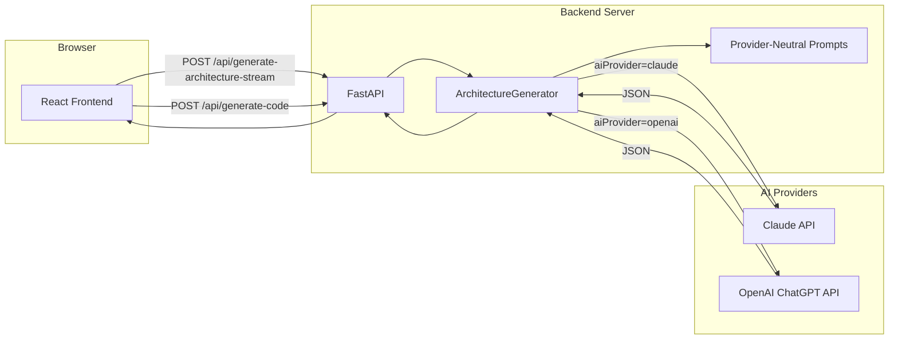
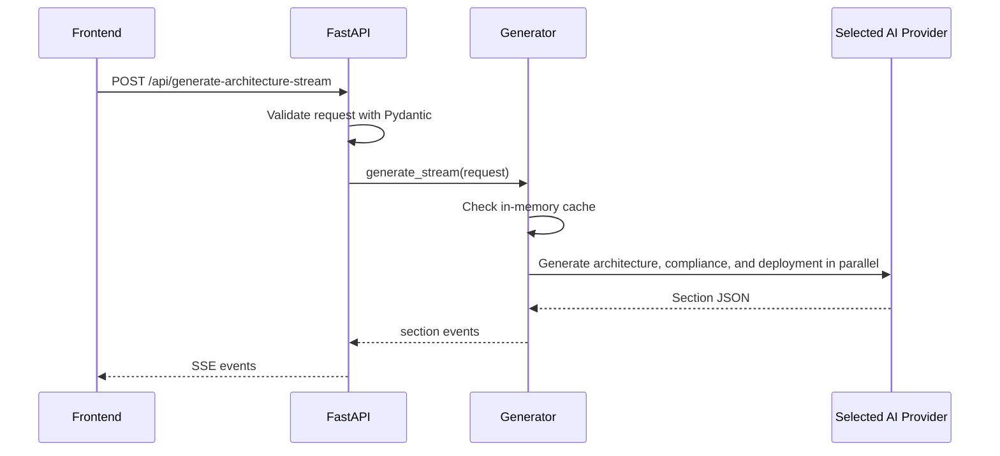

# Architecture Documentation

## System Overview


```mermaid
flowchart LR
    subgraph Client["Browser"]
        UI[React Frontend]
    end

    subgraph Backend["Backend Server"]
        API[FastAPI]
        GEN[ArchitectureGenerator]
        PROMPTS[Provider-Neutral Prompts]
    end

    subgraph Providers["AI Providers"]
        CLAUDE[Claude API]
        OPENAI[OpenAI ChatGPT API]
    end

    UI -->|POST /api/generate-architecture-stream| API
    UI -->|POST /api/generate-code| API
    API --> GEN
    GEN --> PROMPTS
    GEN -->|aiProvider=claude| CLAUDE
    GEN -->|aiProvider=openai| OPENAI
    CLAUDE -->|JSON| GEN
    OPENAI -->|JSON| GEN
    GEN --> API
    API --> UI
```

The system is a three-tier application:

1. **Frontend (React)**: Captures healthcare architecture requirements and renders streamed results.
2. **Backend (FastAPI)**: Validates requests, assembles healthcare/cloud/provider prompts, and routes model calls.
3. **AI Provider APIs**: Claude or OpenAI ChatGPT generate architecture JSON and code examples.

## Frontend Architecture

### Technology Stack

- React 18 with TypeScript
- Vite for build tooling
- TailwindCSS for styling
- Mermaid.js for diagram rendering
- Lucide React for icons

### Component Responsibilities

| Component | Location | Purpose |
|-----------|----------|---------|
| `App` | `src/App.tsx` | Root component, streaming state, form state, code generation |
| `ConfigurationForm` | `components/form/ConfigurationForm.tsx` | Selects use case, deployment cloud, AI provider, integration pattern, data classification, and scale |
| `InfoPanel` | `components/form/InfoPanel.tsx` | Feature summary and provider-neutral positioning |
| `ResultsDashboard` | `components/results/ResultsDashboard.tsx` | Tab container, export actions, generated result shell |
| `SummaryTab` | `components/results/SummaryTab.tsx` | Executive summary, business value, and next steps |
| `ArchitectureTab` | `components/results/ArchitectureTab.tsx` | Diagram, components, data flows |
| `ComplianceTab` | `components/results/ComplianceTab.tsx` | HIPAA checklist and BAA guidance |
| `DeploymentTab` | `components/results/DeploymentTab.tsx` | Deployment steps, IAM, network, monitoring |
| `RoadmapTab` | `components/results/RoadmapTab.tsx` | Phased implementation roadmap |
| `RiskTab` | `components/results/RiskTab.tsx` | Risk register with mitigation and ownership |
| `CodeTab` | `components/results/CodeTab.tsx` | On-demand Python and TypeScript samples |

### State Shape

```typescript
interface ArchitectureRequest {
  useCase: 'clinical-documentation' | 'prior-authorization' | 'medical-coding' | 'patient-communication';
  cloudPlatform: 'aws-bedrock' | 'gcp-vertex';
  aiProvider: 'claude' | 'openai';
  integrationPattern: 'api-gateway' | 'event-driven' | 'batch-processing';
  dataClassification: 'phi' | 'pii' | 'de-identified' | 'public';
  scaleTier: 'pilot' | 'production' | 'enterprise';
}
```

`cloudPlatform` values are retained for backward compatibility. In product language they represent deployment cloud targets: AWS and Google Cloud.

## Backend Architecture

### Technology Stack

- Python 3.11+
- FastAPI for API framework
- Pydantic for request/response validation
- Anthropic SDK for Claude
- OpenAI SDK for OpenAI ChatGPT
- sse-starlette for Server-Sent Events

### Application Structure

```
backend/
├── app/
│   ├── main.py              # FastAPI application and endpoints
│   ├── models.py            # Pydantic request/response models
│   └── services/
│       └── generator.py     # Prompt assembly and AI provider routing
├── prompts/
│   ├── system_prompt.txt
│   ├── healthcare_context.txt
│   ├── aws_bedrock_context.txt
│   └── gcp_vertex_context.txt
├── templates/
│   └── example_output.md
└── requirements.txt
```

### Request Flow


```mermaid
sequenceDiagram
    participant FE as Frontend
    participant API as FastAPI
    participant GEN as Generator
    participant AI as Selected AI Provider

    FE->>API: POST /api/generate-architecture-stream
    API->>API: Validate request with Pydantic
    API->>GEN: generate_stream(request)
    GEN->>GEN: Check in-memory cache
    GEN->>AI: Generate architecture, compliance, and deployment in parallel
    AI-->>GEN: Section JSON
    GEN-->>API: section events
    API-->>FE: SSE events
```

### Prompt Assembly

The generator composes prompts from:

- **System Prompt**: Healthcare IT solution architect role and output requirements
- **Healthcare Context**: HIPAA, PHI, safeguards, and BAA considerations
- **Use Case Context**: Inline requirements for documentation, prior authorization, coding, and communication workflows
- **Cloud Context**: AWS or Google Cloud deployment services and security patterns
- **AI Provider Context**: Claude or OpenAI ChatGPT invocation, credential, BAA, and sample-code guidance
- **Example Output**: Provider-neutral JSON example used as a schema guide

The model is instructed to use the selected AI provider consistently in diagrams, component names, compliance guidance, deployment steps, and sample code.

### Streaming Performance

The streaming endpoint uses parallel section generation instead of one large model response. The backend launches independent model calls for:

- `architecture`
- `compliance`
- `deployment`

Each completed section is emitted as an SSE `section` event. Completed section sets are cached in memory using the full request configuration, so repeated demo runs for the same use case/cloud/provider/pattern/classification/scale return almost immediately. The cache is process-local and resets on service restart.

### Provider Routing

`ArchitectureGenerator` initializes provider clients when their keys are present:

| Provider | Environment Variables | Default Model |
|----------|-----------------------|---------------|
| Claude | `ANTHROPIC_API_KEY`, optional `ANTHROPIC_MODEL` | `claude-sonnet-4-20250514` |
| OpenAI ChatGPT | `OPENAI_API_KEY`, optional `OPENAI_MODEL` | `gpt-5.2` |

At least one provider key is required at backend startup. If a request selects a provider without a configured key, the API returns `503 Selected AI provider is not configured`.

## API Surface

| Endpoint | Purpose |
|----------|---------|
| `GET /api/health` | Health check |
| `POST /api/generate-architecture` | Full non-streaming generation with sample code |
| `POST /api/generate-architecture-stream` | Streaming generation without sample code |
| `POST /api/generate-code` | On-demand sample code generation |

## Compliance Design

Generated architectures should always include:

- Minimum necessary PHI handling
- BAA requirements for the deployment cloud, AI provider, and any service handling PHI
- Encryption in transit and at rest
- Secret management for provider credentials
- Audit logging without raw PHI in logs
- Human review controls for clinical output
- Monitoring for errors, denied access, model usage, and abnormal traffic

## Operational Notes

- Streaming generation is preferred for the UI because it generates architecture, compliance, and deployment sections in parallel and progressively loads each completed section.
- Sample code is generated on demand to reduce initial latency.
- Repeated configurations are served from an in-memory backend cache.
- Responses are parsed as JSON and validated through Pydantic/Zod.
- The app keeps provider choice explicit so partner demos can compare architectures without rewriting deployment-cloud assumptions.
